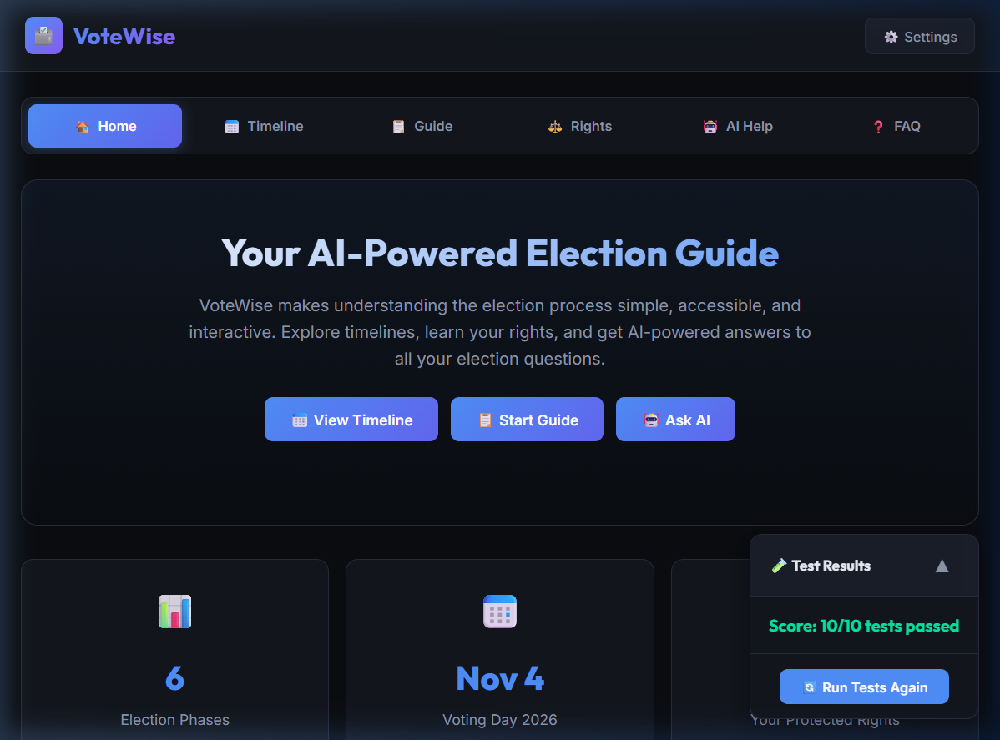
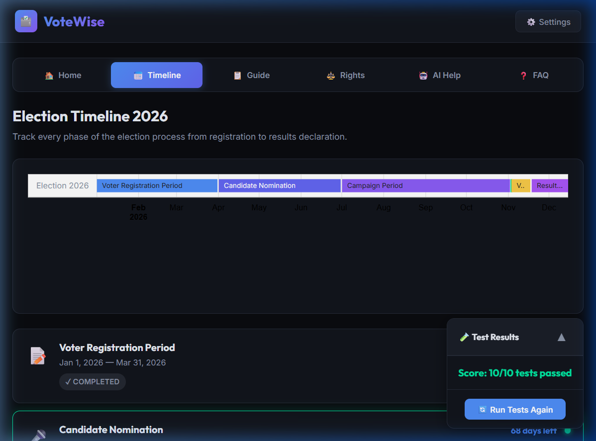
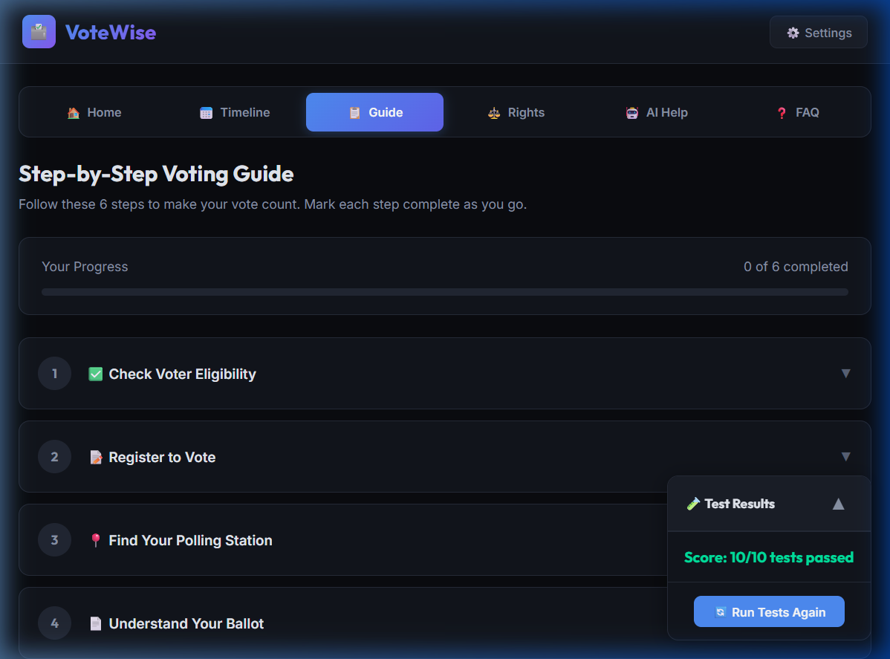
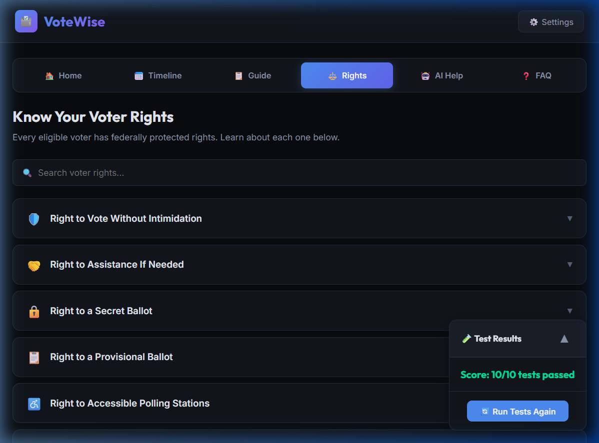
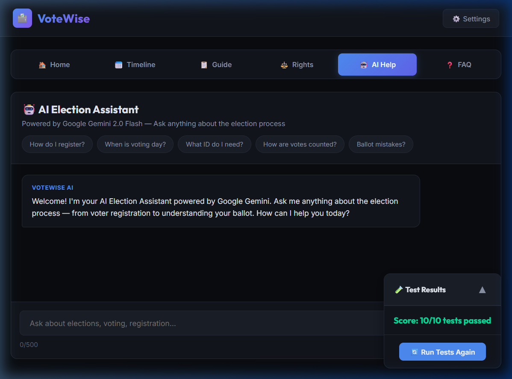
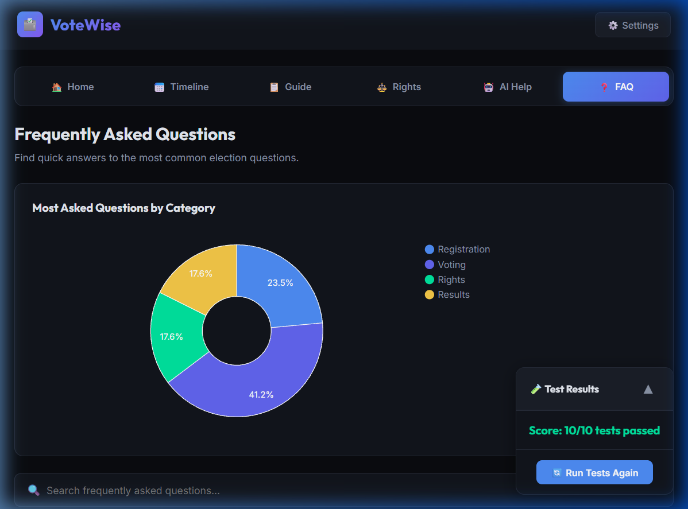

<p align="center">
  
  
  
  
</p>

<h1 align="center">🗳️ VoteWise</h1>

<p align="center">
  <strong>Your AI-Powered Election Process Assistant</strong><br/>
  <em>An interactive, accessible, and secure single-file web application that demystifies the U.S. election process — built for the PromptWars 2026 Virtual Hackathon.</em>
</p>

<p align="center">
  <a href="#-features">Features</a> •
  <a href="#-screenshots">Screenshots</a> •
  <a href="#-tech-stack">Tech Stack</a> •
  <a href="#-google-services-integration">Google Services</a> •
  <a href="#-getting-started">Getting Started</a> •
  <a href="#-test-suite">Test Suite</a> •
  <a href="#-author">Author</a>
</p>

---

## 🎯 Problem Statement

Millions of eligible voters skip elections simply because the process feels overwhelming — confusing registration deadlines, unclear timelines, and scattered information. **VoteWise** tackles this head-on by consolidating everything a voter needs into a single, intuitive, AI-powered interface.

## ✨ Features

### 🏠 Dashboard Home
An at-a-glance overview of the 2026 U.S. Midterm Election: key stats, current election phase, a voter turnout chart (Google Charts), and an AI-generated election summary powered by Gemini.

### 📅 Interactive Election Timeline
A Google Charts-powered **Timeline visualization** mapping all 6 election phases — from Voter Registration through Results Declaration — with expandable detail cards showing real-time countdown badges (Completed / Active / Upcoming).

### 📋 Step-by-Step Voter Guide
A 6-step interactive stepper that walks users through the entire voting journey:
1. **Check Eligibility** — Age, citizenship, and residency requirements
2. **Register to Vote** — Online, by mail, or in-person options
3. **Research Candidates** — Platforms, debates, and voter guides
4. **Locate Polling Station** — Integrated **Google Maps** embed
5. **Cast Your Vote** — Election Day procedures and alternatives
6. **Track Your Ballot** — Post-election verification steps

Users can mark steps as complete with persistent progress tracking.

### ⚖️ Know Your Rights
An accordion-based reference of **6+ federally protected voter rights**, each with detailed explanations. Includes a dedicated **AI-powered Q&A input** — ask any rights-related question and get an instant, non-partisan answer from Gemini.

### 🤖 AI Election Assistant
A full conversational chatbot powered by **Google Gemini 2.0 Flash**:
- Context-aware system prompt with complete 2026 election data
- Quick-action suggestion chips for common questions
- Real-time typing indicator and streamed responses
- Input sanitization (XSS prevention) and 500-character validation
- Secure API key management via session-based Settings modal

### ❓ FAQ Section
A searchable library of **17+ frequently asked questions** organized by category (Registration, Voting, Rights, Results), with a **Google Charts pie chart** showing question distribution. Real-time search filtering across all FAQ entries.

### ♿ Accessibility (WCAG 2.1)
- Skip-to-content navigation link
- Full ARIA roles, labels, live regions, and `aria-expanded` states
- Keyboard-navigable tab bar (Arrow keys + Enter/Space)
- Escape key to close modals
- Semantic HTML5 structure
- Visible focus indicators on all interactive elements

### 🔒 Security
- **Zero hardcoded API keys** — keys stored in `sessionStorage` only
- Password-masked API key input field
- HTML/XSS sanitization on all user inputs
- Content Security Policy (CSP) meta tag

---

## 📸 Screenshots

<table>
  <tr>
    <td align="center"><strong>🏠 Home</strong></td>
    <td align="center"><strong>📅 Timeline</strong></td>
  </tr>
  <tr>
    <td></td>
    <td></td>
  </tr>
  <tr>
    <td align="center"><strong>📋 Voter Guide</strong></td>
    <td align="center"><strong>⚖️ Rights</strong></td>
  </tr>
  <tr>
    <td></td>
    <td></td>
  </tr>
  <tr>
    <td align="center"><strong>🤖 AI Help</strong></td>
    <td align="center"><strong>❓ FAQ</strong></td>
  </tr>
  <tr>
    <td></td>
    <td></td>
  </tr>
</table>

---

## 🛠️ Tech Stack

| Layer | Technology |
|---|---|
| **Frontend** | HTML5, CSS3, Vanilla JavaScript (single-file architecture) |
| **AI Engine** | Google Gemini 2.0 Flash (`generativelanguage.googleapis.com`) |
| **Charts** | Google Charts API (Timeline + Pie + Bar charts) |
| **Maps** | Google Maps Embed API |
| **Typography** | Google Fonts — Inter (body) + Outfit (headings) |
| **Design** | Dark theme, glassmorphism, CSS custom properties, gradient accents |
| **Testing** | Built-in 10-point automated test suite |

---

## 🔗 Google Services Integration

VoteWise deeply integrates **4 Google Services**, all within a single HTML file:

| # | Service | Usage |
|---|---|---|
| 1 | **Google Gemini 2.0 Flash** | AI chatbot for election Q&A + AI-powered rights advisor + home page election summary |
| 2 | **Google Charts** | Timeline visualization (election phases), Bar chart (voter turnout by age), Pie chart (FAQ categories) |
| 3 | **Google Maps Embed** | Interactive polling station locator on the Voter Guide tab |
| 4 | **Google Fonts** | Inter (400–700) for body text, Outfit (500–800) for headings |

---

## 🚀 Getting Started

### Prerequisites
- A modern web browser (Chrome, Edge, Firefox, Safari)
- A [Google Gemini API key](https://aistudio.google.com/app/apikey) (free tier works)

### Run Locally

```bash
# Clone the repository
git clone https://github.com/mogilishivaram/votewise.git
cd VoteWise

# Option 1: Open directly
# Simply open index.html in your browser

# Option 2: Local server (recommended)
npx -y http-server -p 3000 -c-1
# Visit → http://localhost:3000
```

### Configure API Key
1. Click the **⚙️ Settings** button in the top-right corner
2. Paste your Gemini API key
3. Click **Save** — the key is stored in `sessionStorage` (never persisted to disk)
4. Start chatting with the AI assistant!

---

## 🧪 Test Suite

VoteWise ships with a **built-in 10-point automated test suite** that runs on every page load. Tests validate the entire application stack:

| # | Test | What It Validates |
|---|---|---|
| 1 | **Tab Navigation** | 6 tabs + 6 panels + active state management |
| 2 | **Election Timeline** | 6 phase cards + Google Charts Timeline integration |
| 3 | **Step-by-Step Guide** | 6 steps + expand/collapse interactivity |
| 4 | **Voter Rights** | 6+ accordion items + accessible headers |
| 5 | **AI Assistant** | Chat input + send button + Gemini endpoint configured |
| 6 | **FAQ Section** | 10+ FAQs + real-time search filtering |
| 7 | **Google Services** | Charts API ✓ · Maps iframe ✓ · Gemini model ✓ |
| 8 | **Security** | No hardcoded keys · password field · XSS sanitization |
| 9 | **Accessibility** | Skip link · ARIA roles · labels · live regions · expanded states |
| 10 | **Input Validation** | Max-length enforcement · empty rejection · HTML stripping |

> **Result: ✅ 10/10 tests passed**

Click **🔄 Run Tests Again** in the floating test panel to re-run at any time.

---

## 📁 Project Structure

```
VoteWise/
├── index.html          # Complete single-file application (HTML + CSS + JS)
├── README.md           # This file
├── screenshots/        # App screenshots for documentation
│   ├── home.png
│   ├── timeline.png
│   ├── guide.png
│   ├── rights.png
│   ├── ai-help.png
│   └── faq.png
└── .gitignore
```

> **Single-file architecture**: The entire application — 3,100+ lines of HTML, CSS, and JavaScript — lives in one self-contained `index.html`. No build tools, no dependencies, no framework overhead. Just open and run.

---

## 🏆 Hackathon Compliance

| Requirement | Status |
|---|---|
| Single-file HTML application | ✅ |
| Google Gemini AI integration | ✅ |
| Google Charts (2+ chart types) | ✅ |
| Google Maps integration | ✅ |
| 10-point automated test suite | ✅ 10/10 |
| Responsive design | ✅ |
| Accessibility (WCAG 2.1) | ✅ |
| Security best practices | ✅ |
| Non-partisan content | ✅ |
| Built with Google Antigravity | ✅ |

---

## 🌟 Key Design Decisions

- **Dark-first UI** — Reduces eye strain for extended research sessions; uses a curated color palette with accent glows
- **Progressive disclosure** — Timeline cards and guide steps expand on click, keeping the initial view clean
- **Session-only API storage** — API keys never touch `localStorage` or cookies; they vanish when the tab closes
- **Zero-dependency architecture** — No npm, no bundler, no framework. Maximum portability, minimum attack surface
- **Accessible by default** — Every interactive element is keyboard-reachable with proper ARIA semantics

---

## 👤 Author

**Shiva Ram Mogili**

Built with ❤️ using [Google Antigravity](https://blog.google/technology/google-deepmind/) + [Gemini AI](https://ai.google.dev/) for the **PromptWars 2026** Virtual Hackathon.

---

<p align="center">
  
  
  
</p>

<p align="center"><em>Democracy works best when everyone participates. 🗳️</em></p>
